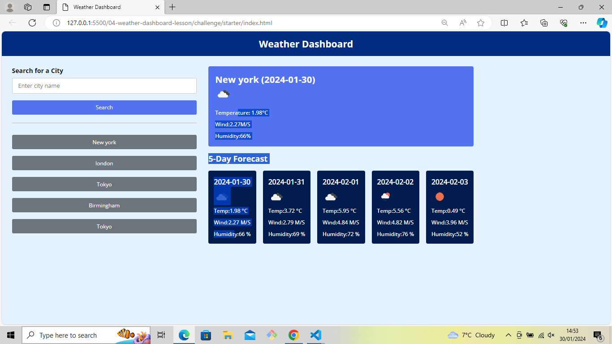

# Weather-Forecast-App

Description:
5 Day Weather Forecast :

- A weather dashboard with form inputs.
- When city is searched in the input the forecast is presented with current and future conditions for that city and that city is added to the search history
- When the current weather conditions for that city they are presented with:
  The city name
  The date
  An icon representation of weather conditions
  The temperature
  The humidity
  The wind speed
  When a user view future weather conditions for that city they are presented with a 5-day forecast that displays:
  The date
  An icon representation of weather conditions
  The temperature
  The humidity
  When a user click on a city in the search history they are again presented with current and future conditions for that city

App screenshot

URL of deployed application https://almasmansuri.github.io/Weather-Forecast-App/
